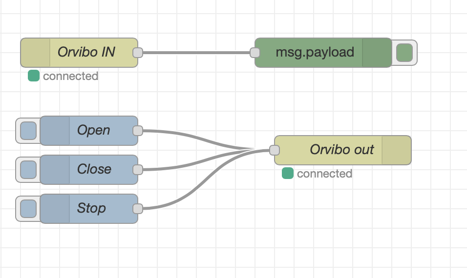

# Orvibo/HomeMate/A-OK WebSocket server

A Node-RED compatible WebSocket server to control the Orvibo/HomeMate smart curtains (and maybe sockets as well, not tested).

This is based on Orvibo B25 Server by SandySound [http://github.com/sandysound/orvibo-b25-server]

For this to work, you need to forward ``homemate.orvibo.com`` TCP port 10001 to a computer running this server. In my Hass.io setup this can be easily done by using dnsmasq plugin.

Node-RED flow can be found [here](orvibo.flow)

## Security

Security of these devices are very questionnable and I would recommend only running these only in a separate network and not allow them to connect to the internet. More about this [here](https://www.gearbrain.com/orvibo-smart-home-data-leak-2639044270.html).

Encryption key can be extracted with [this](https://gist.github.com/Grayda/eb48093bcfb96bfeec9c58ea301f2668).

## Compatibility

Tested to work with A-OK AM68 Wifi enabled curtain motor.

## License

This project is licensed under the Apache 2.0 License - see the [LICENSE.md](LICENSE.md) file for details

## Acknowledgments

Based on orvibo-b25-server by [SandySound - Github](https://github.com/sandysound)

Big thanks to [Grayda](https://github.com/Grayda/) and [insertjokehere](https://github.com/insertjokehere) for all their research and hard work into how these sockets work

